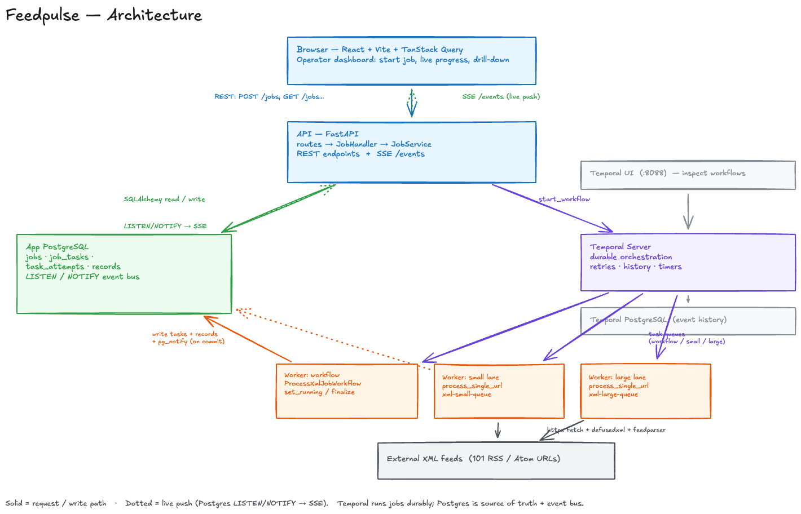
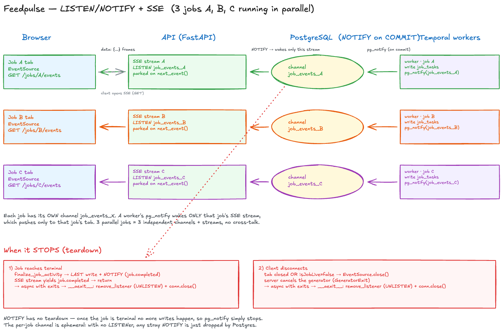

# Feedpulse

Feedpulse is a locally runnable concurrent XML ingestion pipeline with an operator
dashboard. A job starts immediately, fans out URL work through Temporal workers,
persists attempts and extracted records in Postgres, and streams live progress to
the UI over SSE.



## What It Does

- `POST /jobs` starts a new processing run and returns a `job_id` immediately
- each URL is fetched, parsed, normalized, and persisted as extracted records
- record summaries are stored as sanitized plain-text excerpts (HTML stripped, truncated)
- transient failures retry with backoff; permanent failures stay inspectable
- the dashboard shows recent jobs, live progress, task failures, and retry detail
- progress includes per-second throughput and an estimated time-to-completion
- `GET /jobs/:id/tasks/:task_id/records` is paginated with `limit` and `offset`

## Stack

- Frontend: React 19, Vite, TypeScript, TanStack Query
- API: FastAPI
- Orchestration: Temporal Python SDK + Temporal Server
- Database: PostgreSQL + SQLAlchemy async ORM + Alembic
- Real-time updates: Server-Sent Events backed by Postgres `LISTEN/NOTIFY`
- XML handling: `httpx`, `defusedxml`, `feedparser`
- Logging: structured JSON logs to stdout

## Run It

```bash
docker compose up --build
```

Default services:

- `app-postgres`
- `db-migrate`
- `api`
- `frontend`
- `temporal-postgres`
- `temporal`
- `temporal-ui`
- `temporal-worker-workflow`
- `temporal-worker-small`
- `temporal-worker-large`

Ports:

- API: `http://localhost:8000`
- Frontend: `http://localhost:5173`
- Temporal UI: `http://localhost:8088`
- App Postgres: `localhost:5433`

## Frontend Workflow

```bash
cd frontend
pnpm install
pnpm dev
```

The dev server talks to the live API at `VITE_API_BASE_URL` (defaults to
`http://localhost:8000/api/v1`), so start the backend stack first.

## Backend Workflow

```bash
cd backend
uvicorn app.main:app --reload
```

Database config lives in `backend/.env.example`. The URL seed list used for job
creation lives in `backend/app/data/xml_sources.py`.

## Backend Design Decisions

Concurrency model:

- one Temporal workflow maps to one Feedpulse job
- one Temporal activity maps to one URL fetch/parse/persist attempt
- the API returns immediately after the workflow is started
- workers are split into workflow, small-lane, and large-lane processes

Queue and worker choice:

- Temporal was chosen over an in-process queue because it gives durable retries,
  observable execution state, and explicit workflow history
- `xml-small-queue` handles normal feeds
- `xml-large-queue` isolates larger feeds and prevents them from starving smaller work

Retry policy:

- transient failures such as timeouts, transport errors, `429`, and `5xx` raise
  retryable `FeedFetchError`
- permanent failures such as `4xx` client errors, malformed XML, and oversized
  responses are recorded as terminal task failures
- Temporal retry policy is configured in `backend/app/temporal/workflows.py`

Logging strategy:

- the API writes JSON logs to stdout through `backend/app/core/logging.py`
- significant workflow events include structured `job_id` and `task_id` fields
- request logs, task transitions, workflow start/reuse, XML fetch outcomes, and
  reconciliation repairs are all emitted as structured events

Database write strategy:

- `jobs`, `job_tasks`, and `task_attempts` are modeled through SQLAlchemy ORM
- extracted `records` are inserted through bulk SQLAlchemy Core statements
- task-attempt and record writes are idempotent against DB constraints

## Live Updates (SSE + Postgres LISTEN/NOTIFY)



Each job has its own Postgres channel (`job_events_<id>`). A Temporal worker
`pg_notify`s on commit, which wakes only that job's SSE stream, which pushes
`data:` frames to only that job's browser tab — so N parallel jobs stay
isolated. The stream's `LISTEN` connection is torn down (`UNLISTEN` + close)
when the job reaches a terminal state or the client disconnects.

## Frontend Design Decisions

Real-time approach:

- the UI uses SSE through `EventSource`
- the backend emits `job.snapshot`, `job.progress`, `task.updated`, and
  `job.completed` events
- DB-backed SSE is refreshed by Postgres notifications with a read-model fallback

State management:

- TanStack Query handles REST reads, cache invalidation, and async state
- SSE events patch or invalidate the affected queries rather than adding a second
  client-side state layer

Loading and error handling:

- route-level loading states exist for jobs, tasks, and record pages
- task detail surfaces attempts, HTTP status, duration, and failure details
- record browsing is paginated so high-volume feeds do not dump the full payload
  into one response or one render pass

## API Notes

Primary endpoints:

- `POST /api/v1/jobs`
- `GET /api/v1/jobs`
- `GET /api/v1/jobs/:id`
- `GET /api/v1/jobs/:id/tasks?status=failed&sort=attempts`
- `GET /api/v1/jobs/:id/tasks/:task_id`
- `GET /api/v1/jobs/:id/tasks/:task_id/records?limit=20&offset=0`
- `GET /api/v1/jobs/:id/events`

Paginated records response shape:

```json
{
  "items": [],
  "total": 1499,
  "limit": 20,
  "offset": 0,
  "has_more": true
}
```

## Verification

Frontend build:

```bash
cd frontend
pnpm build
```

Backend tests:

```bash
docker compose exec -T api python -m unittest discover -s /app/tests
```

Live runtime verification:

```bash
docker compose exec -T api python /app/scripts/verify_live_runtime.py --base-url http://127.0.0.1:8000/api/v1
```

Live SSE verification:

```bash
docker compose exec -T api python /app/scripts/verify_live_sse.py --base-url http://127.0.0.1:8000/api/v1
```

Live failure-path verification:

```bash
docker compose exec -T api python /app/scripts/verify_live_failures.py --base-url http://127.0.0.1:8000/api/v1
```

Live idempotency verification:

```bash
docker compose exec -T api python /app/scripts/verify_live_idempotency.py --base-url http://127.0.0.1:8000/api/v1
```

Live retry-path verification:

```bash
docker compose exec -T api python /app/scripts/verify_live_retries.py --base-url http://127.0.0.1:8000/api/v1
```

Live reconciliation verification:

```bash
docker compose exec -T api python /app/scripts/verify_live_reconciliation.py --base-url http://127.0.0.1:8000/api/v1
```

Structured logging spot-check:

```bash
docker compose logs api | tail -n 20
```

Those log lines should be JSON objects containing event names and fields such as
`job_id`, `task_id`, `status_code`, `error_type`, and `counts`.

## Tradeoffs

- Feedpulse favors operator visibility and durable workflow state over minimal
  infrastructure. Temporal is heavier than a single-process queue, but better for
  inspectability and retry semantics.
- The records endpoint is paginated, but the current UI only provides simple
  previous/next pagination rather than richer cursoring or virtualized browsing.
- The job URL list is a fixed in-repo seed (`backend/app/data/xml_sources.py`)
  rather than user-supplied input.

## How It Breaks At Scale

At 10x scale, around 1000 URLs per job:

- one job creates much larger task and event fanout
- Postgres notification churn and task-list refetches become more expensive
- a single job detail view would need stronger query shaping or virtualization
- worker concurrency and DB pool sizing would need to move from fixed local values
  to measured capacity planning

At 100x scale, around 10k URLs per job:

- one-workflow-per-job remains valid, but task fanout, history size, and read-model
  refresh costs become much more sensitive
- task summaries should move toward denormalized projections or partitioned reads
- SSE on a fully expanded task table becomes too chatty without aggregation
- extracted records likely need partitioning, retention rules, or object-storage
  offloading depending on payload size and history requirements

## Demo

Trigger a job from the dashboard, watch live progress over SSE, drill into a
failed or retried task, and page through the extracted records.
